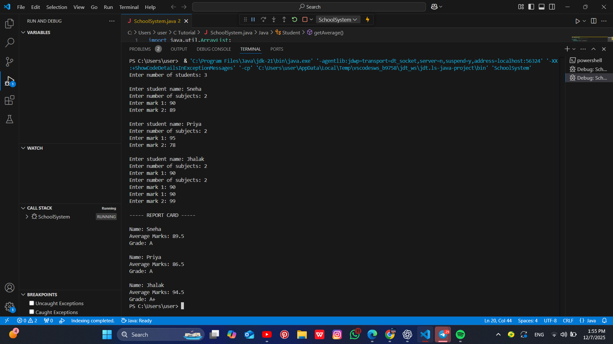

# School Grading System

## Description  
This project is a simple Java-based school grading system that allows you to input student names and their marks, and then calculates their average and grade.

## Features  
- Add multiple students and their marks.  
- Calculate the average marks for each student.  
- Assign grades based on the average marks.

## How to Run the Project  
1. Ensure you have Java installed on your computer.  
2. Compile the Java file using the command:  
   ```bash

   ## Output Screenshot



   javac SchoolSystem.java
